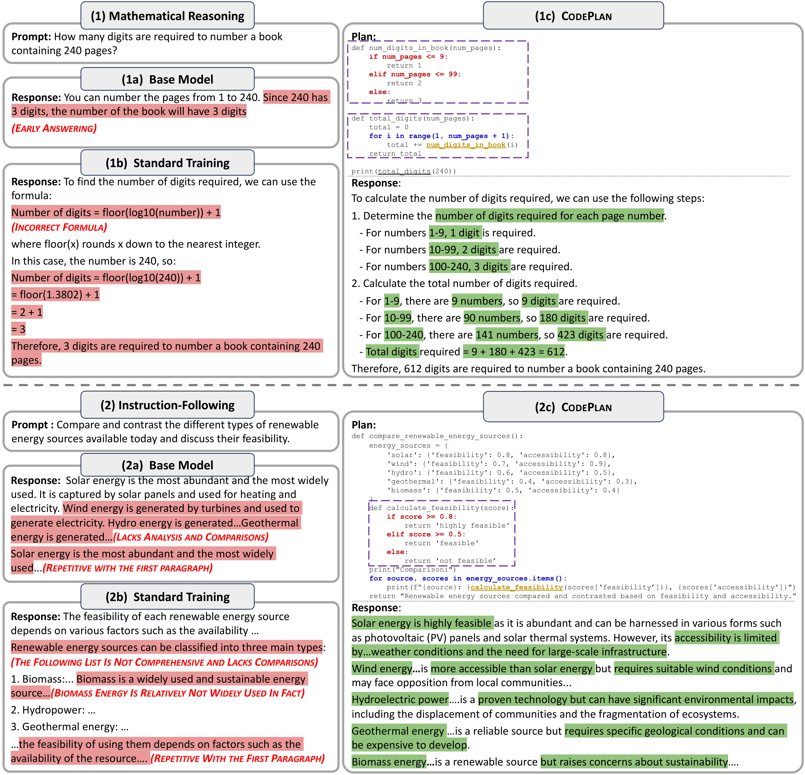

## Unlocking Reasoning Potential in Large Language Models by Scaling Code-form Planning

This repository contains the dataset for our paper:

> [Unlocking Reasoning Potential in Large Language Models by Scaling Code-form Planning](https://arxiv.org/pdf/2409.12452)

In this work, we introduce CodePlan, a scalable framework that empowers LLMs to generate and follow *code-form plans*---pseudocode that outlines high-level, structured reasoning processes. 

By leveraing the structured and versatile nature of code, CodePlan effectively captures the rich semantics and control flows inherent to sophisticated reasoning tasks.

### Dataset

huggingface dataset: [link](https://huggingface.co/datasets/jiaxin-wen/CodePlan)
